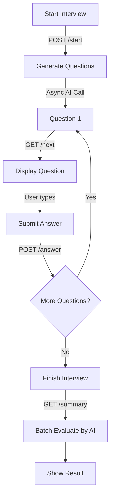

# Interview System Flow Architecture

This document outlines the end-to-end data flow and architectural interactions of the interview system, illustrating how the Frontend, Backend, and AI modules communicate.

---

## High-Level Architecture Flow

## 1. Interview Start Flow
**Frontend → Backend → AI Module → Backend → Frontend**

* **Frontend:** The user selects their interview preferences (subject, difficulty, Bloom's level, number of questions) on the `InterviewConfig` page and clicks "Start".
* **Backend:** The `POST /api/v1/interview/start` endpoint receives the payload. The backend creates a new `InterviewSession` in the database.
* **AI Module:** The backend triggers an asynchronous background task requesting the AI module to generate the requested number of questions based on the configuration.
* **Backend:** The generated questions are saved into the `InterviewQuestion` table.
* **Frontend:** The backend responds with the `session_id`, and the frontend navigates the user to the `InterviewScreen`.

## 2. Question Generation (Fetching Next Question)
**Frontend → Backend → Frontend**

* **Frontend:** The `InterviewScreen` requests the first/next question via `GET /api/v1/interview/{session_id}/next`.
* **Backend:** The backend checks the database for the earliest `InterviewQuestion` in the session that does not have an associated `Answer`.
* **Frontend:** If a question is found, the backend returns it, and the `QuestionCard` component displays the question text to the user.

## 3. Answer Submission
**Frontend → Backend → Frontend**

* **Frontend:** The user types their textual response and submits it. The frontend calls `POST /api/v1/interview/{session_id}/answer`.
* **Backend:** The backend receives the answer. Crucially, to ensure a fast and uninterrupted user experience, the backend **saves the answer to the database without immediately evaluating it via the AI**.
* **Frontend:** The backend returns a simple status (`'next'` or `'completed'`). The frontend clears the text box and triggers another call to fetch the next question.

## 4. Interview Completion
**Backend → Frontend**

* **Backend:** During the `GET /next` call, if the backend finds that all questions for the session have answers, it marks the session status as `completed` and returns a termination signal to the client.
* **Frontend:** The `InterviewScreen` detects the 'completed' status and transitions from the question-answering view into a loading state, initiating the request for the final summary.

## 5. Result Generation
**Frontend → Backend → AI Module → Backend → Frontend**

* **Frontend:** The application automatically calls `GET /api/v1/interview/{session_id}/summary` to request grading.
* **Backend:** The backend aggregates all the user's answers for that session.
* **AI Module:** The backend sends the batch of answers to the AI module for comprehensive evaluation against the original questions and constraints. The AI scores each answer out of 100 and provides feedback.
* **Backend:** The backend computes the final `average_score` and determines the `performance_level` (Excellent, Strong, Average, Weak). It persists the scores and feedback to the database.
* **Frontend:** The backend returns the full breakdown to the frontend, which then renders the final score ring, performance level badge, and question-by-question feedback list.
